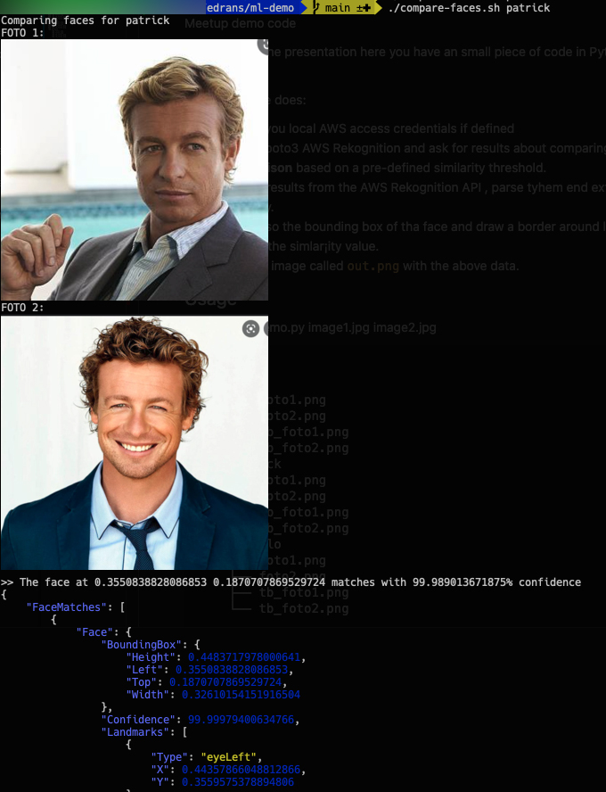
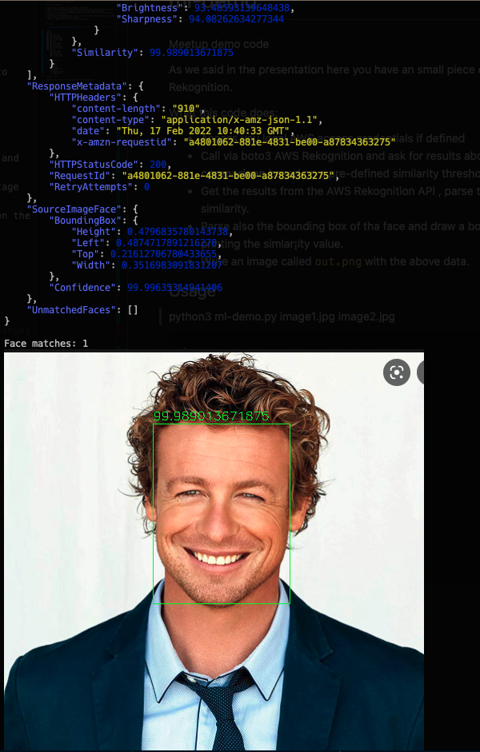

# ml-demo

Meetup demo code 

As we said in the presentation here you have an small piece of code in Python3 to start playing with AWS Rekognition.

What this code does: 

* Access you local AWS access credentials if defined
* Call via boto3 AWS Rekognition and ask for results about comparing 2 pictures and perform **face comparison** based on a pre-defined similarity threshold. 
* Get the results from the AWS Rekognition API , parse them end extract percentage of accuracy in similarity.
* Parse also the bounding box of the face and draw a border around locating it on the picture + printing the similarity value.
* Write an image called `out.png` with the above data.


All this is wrapped up with a simple command line interface using a bash script and `imgcat` to be able to see the images in the terminal window.


---

## Usage 

`export AWS_ACCESS_KEY="<your aws access key>"`
`export AWS_SECRET_KEY="<your aws secret key>"`

`compare-faces.sh <name>`




Where `<name>` can be: `anna|patrick|pocholo` or even the folder name you create with the two pictures to compare (`foto1.png` and `foto2.png`)

```
images
├── anna
│   ├── foto1.png
│   ├── foto2.png
│   ├── tb_foto1.png
│   └── tb_foto2.png
├── patrick
│   ├── foto1.png
│   ├── foto2.png
│   ├── tb_foto1.png
│   └── tb_foto2.png
└── pocholo
    ├── foto1.png
    ├── foto2.png
    ├── tb_foto1.png
    └── tb_foto2.png
```


### Depenedencies

    * imgcat
    * python3
    * -- numpy
    * -- json
    * -- boto3
    * -- opencv-python
    * -- pygments


Feel free to modify everything and play with it! 

Let's see what you can create.